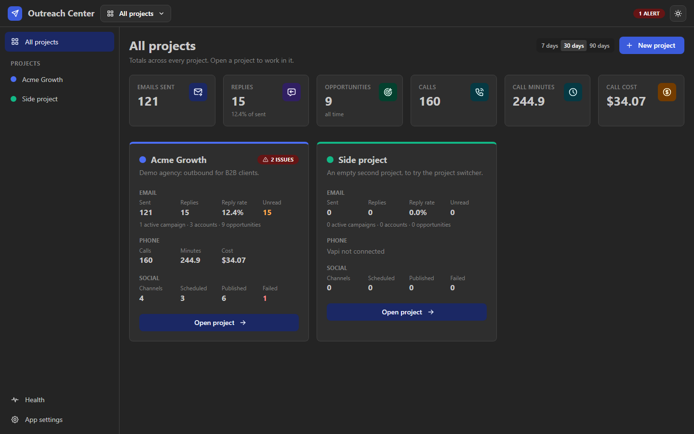
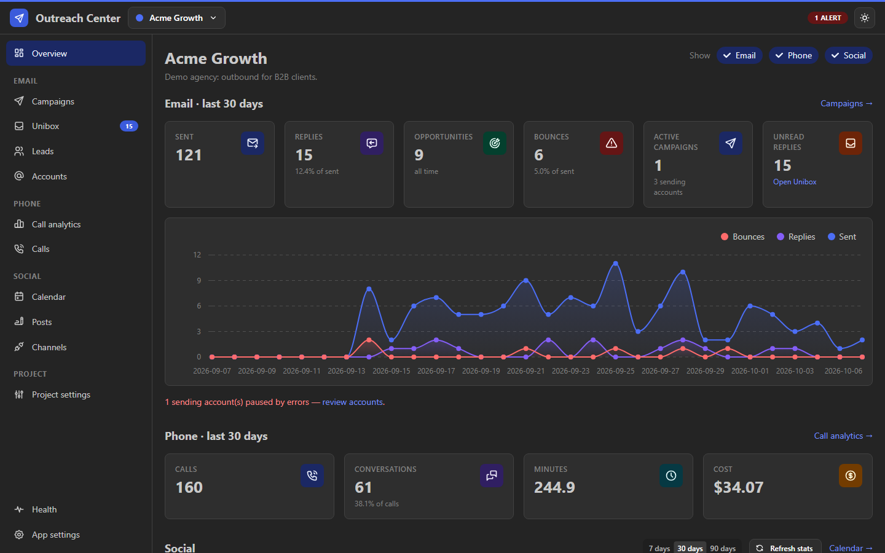
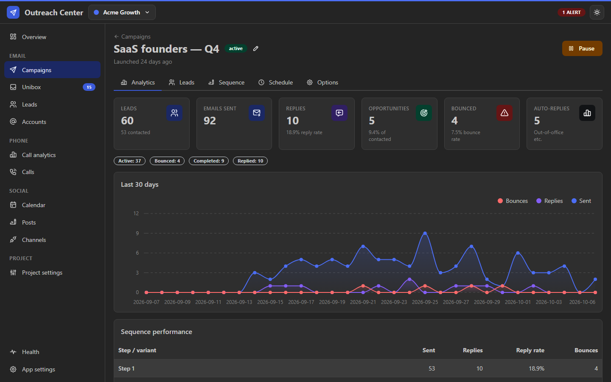
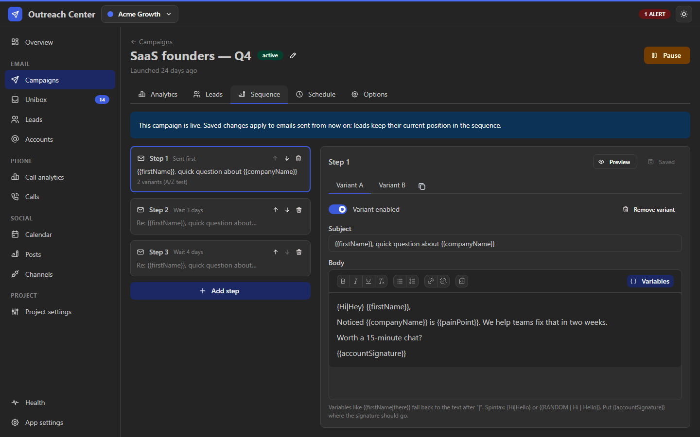
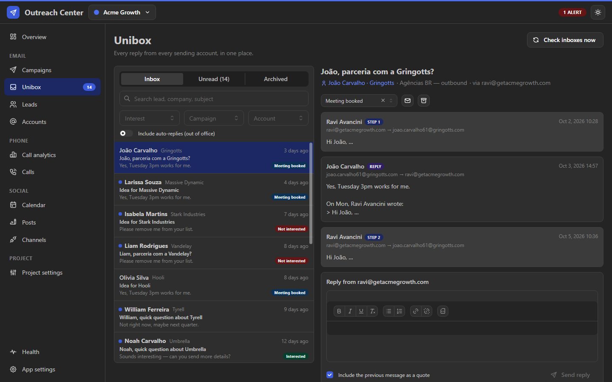
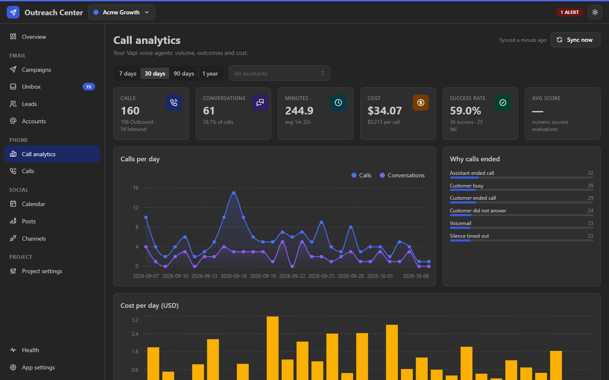
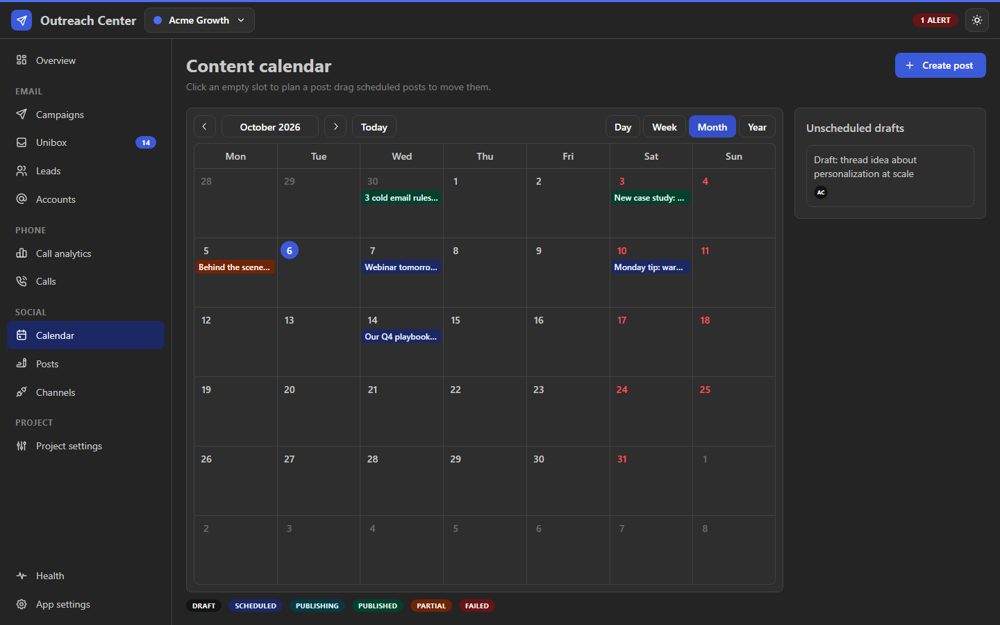

# Outreach Center

**A local-first command center for cold outreach: email campaigns, AI phone calls and social publishing in one app.**

Think Instantly + the Vapi dashboard + Postiz, rebuilt as a single program that runs on one PC: one Node.js process,
one SQLite file, no Docker, no Redis, no cloud services to keep alive.

> This is a showcase. The source code is private. Screenshots use the built-in demo mode, so every company, person
> and number in them is fictional. **Source available to hiring teams on request.**



---

## What it does

| Channel | Modeled after | Highlights |
|---|---|---|
| **Email** | Instantly | Multiple sending accounts with rotation and daily limits, multi-step sequences with A/Z variants, spintax and fallbacks, schedules per timezone, threaded follow-ups, reply / auto-reply / bounce detection, a unified inbox (Unibox), lead statuses, per-step analytics |
| **Phone** | Vapi dashboard | Syncs every AI voice call: volume, outcomes, minutes, cost, recordings, transcripts and summaries, linked to leads by phone number |
| **Social** | Postiz | X, Facebook Pages, Instagram and TikTok: compose once, adjust per channel, schedule on a drag-and-drop calendar, publish with retries, track reach and followers |

Work is organized in **projects**, one per client or business, each with its own accounts, campaigns, leads, calls,
channels and dashboard. The start page totals all of them.

## Screenshots

| | |
|---|---|
|  **Project dashboard**: email, phone and social in one view |  **Campaign analytics**: funnel, daily series, per-step performance |
|  **Sequence editor**: steps, A/Z variants, variables with fallbacks, spintax |  **Unibox**: every reply from every account, threaded, with interest status |
|  **Call analytics**: AI voice agent volume, outcomes and cost |  **Content calendar**: drag to reschedule, per-channel status |

---

## Engineering decisions

The brief I built against was **reliability over features**: an outreach tool that double-sends a cold email or
silently drops a reply costs real money and reputation.

- **Never sends the same email twice, even after a crash.** Each send is recorded before it leaves, inside one
  database transaction. If the process dies mid-send, that message is marked *uncertain* on restart and never
  retried. A missed follow-up is recoverable; a duplicate cold email is not.
- **No job queue to drift out of sync.** The sender doesn't pre-schedule work. Every tick it asks the database which
  leads are due, inside their schedule window, with an account that has capacity. Pausing a campaign or changing a
  limit takes effect immediately.
- **Fails loudly, not silently.** Repeated SMTP, IMAP or API failures pause the affected account or channel and show
  up on a Health page with each background worker's last run, last success and last error.
- **Everything is durable.** Campaign state, messages, post targets and sync cursors all live in SQLite (WAL). Schema
  changes are versioned migrations, preceded by an automatic backup; daily backups keep 14 copies.
- **Secure by default for a local app.** The admin UI binds to loopback only, rejects foreign `Host` headers (DNS
  rebinding) and cross-site requests (CSRF). Credentials are encrypted at rest with AES-256-GCM. Anything that must
  be reachable from the internet (tracking pixel, unsubscribe link, media for Instagram) runs on a separate server
  that exposes only those routes.
- **One language end to end.** TypeScript from database row to React component, with every input validated at the
  boundary, so a whole class of bugs is caught before it runs.

## Architecture

```
 Browser ──tRPC (typed JSON)──▶ ┌──────────────── one Node.js process ────────────────┐
                                │ Admin server (loopback only): UI + API              │
                                │   email · phone · social · system modules           │
                                │                                                     │
                                │ In-process scheduler: crash-safe, non-overlapping   │
                                │   sender · inbox sync · call sync · publisher ·     │
                                │   token refresh · stats · backups · maintenance     │
                                │                                                     │
                                │ Public server (optional, behind a tunnel):          │
                                │   open/click tracking · unsubscribe · media relay   │
                                └──────────────────────────┬──────────────────────────┘
                                                           ▼
                                          SQLite (WAL) · media · recordings · backups
```

## Stack

TypeScript (strict) · Node.js 24 · Fastify · tRPC + Zod · SQLite via better-sqlite3 + Drizzle ORM ·
Nodemailer + ImapFlow · React 19 + Vite + Mantine · Vitest

## Tests

**122 automated tests across 14 suites**, including an integration suite that runs the sender against a real local
SMTP server: rendered content and headers, daily limits, schedule windows, follow-up threading, stop-on-reply,
bounces, crash recovery, and no re-send after a connection drops mid-message.

## Status

| Area | State |
|---|---|
| Email campaigns, Unibox, analytics | Working |
| Vapi call sync and analytics | Working |
| Social publishing (X, Facebook, Instagram, TikTok) | Working |
| Email finder and verifier | Pipeline built and covered by tests, not yet in use. Mailbox checks need outbound port 25, which home ISPs block. Two paths are wired: a pay-per-lookup provider switch, or a small self-hosted probe agent on a VPS (next) |
| Next | Auto-optimize A/Z by reply rate, triggers between channels (e.g. Interested → call task), start a Vapi call from a lead |

---

Built by **Ravi Avancini**, with Claude Code as a pair programmer.
[LinkedIn](https://linkedin.com/in/raviavancini) · ravi.avancini@gmail.com
